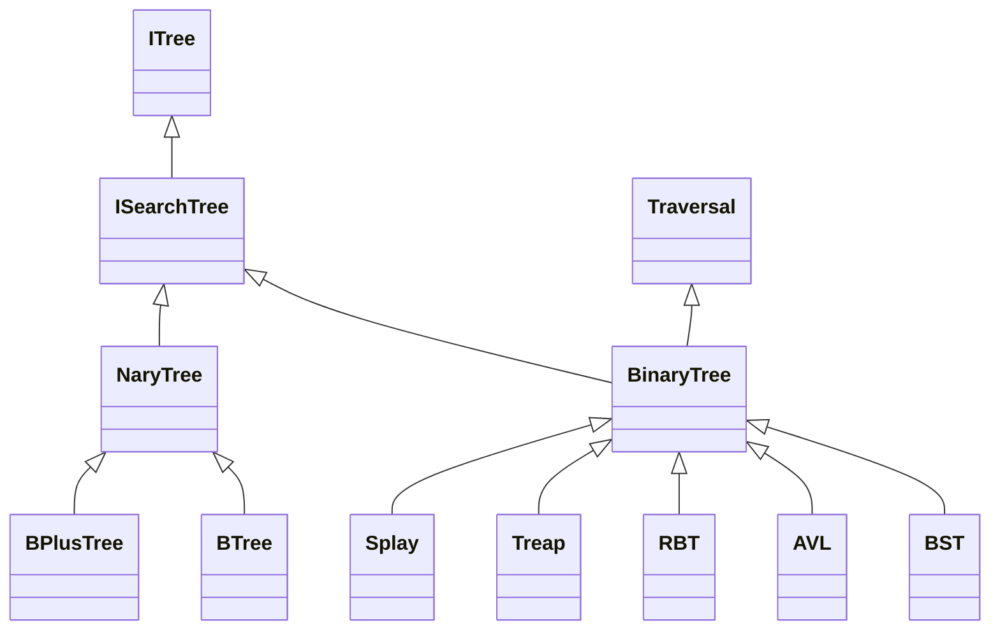
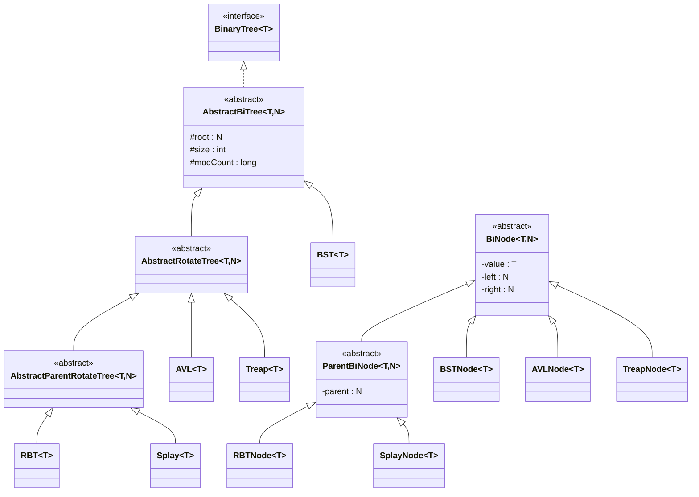
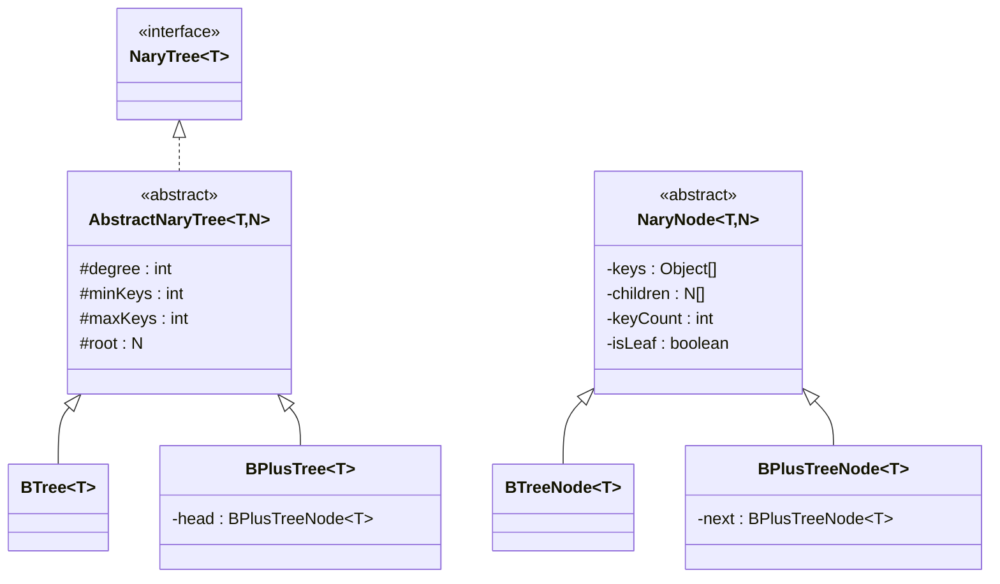

# ChaosTree Architecture

ChaosTree is built on a deeply object-oriented, strongly encapsulated hierarchy. Our goal was to maximize code reuse behind the scenes while keeping the public API as clean and approachable as possible.

At its core, our architecture is driven by a mindset of **Mechanical Sympathy**. We didn't just organize these structures based on theoretical algorithms—we built them around how they physically interact with memory, CPU caches, and the JVM runtime. This led us to create two completely distinct engine families that are optimized for completely different workloads, while still sharing the same underlying search-tree contract.

## High-Level UML Class Diagram

The following diagram illustrates the public API contracts and the implementation families provided by ChaosTree.



---

## Design Philosophy

### 1. API Contract Segregation (`ITree` → `ISearchTree`)

We wanted to clearly separate fundamental container operations from search-tree-specific behavior.

We created `ITree` to define the absolute minimal container contract, exposing things like size management and lifecycle control. We then built `ISearchTree` to extend that foundation with ordering-aware capabilities—things like insertion, deletion, range queries, and predecessor/successor navigation.

This clean separation means all of our search-tree implementations can share a perfectly consistent API, and we never have to force Binary and N-ary trees into unrelated, messy abstractions.

---

### 2. Family-Specific Capabilities

While all implementations share the same search-tree contract, each family exposes behavior unique to its structure.

#### Binary Family

`BinaryTree` introduces operations that naturally belong to a two-child hierarchy, including:

* Least Common Ancestor (LCA)
* Traversal-specific iterators
* Traversal-specific streams
* Traversal-specific list materialization

These capabilities leverage the recursive structure of binary trees and are not meaningful for N-ary search trees.

#### N-ary Family

`NaryTree` introduces operations specific to multi-way branching structures, including:

* Minimum degree inspection
* Maximum degree inspection
* Block-capacity related metadata

These operations reflect the structural characteristics of B-Tree and B+ Tree implementations.

---

### 3. Shared Engine Layers

One of our primary design goals was to completely eliminate duplicated balancing and structural logic.

Instead of writing the same rotation logic over and over again for different self-balancing trees, we extracted that common behavior into dedicated engine layers.

We built `AbstractRotateTree` to centralize all the core rotation mechanics used by our AVL, Red-Black, Treap, and Splay trees. 

Then, we created `AbstractParentRotateTree` to extend that foundation with parent-aware operations, like parent rewiring and node transplants. This lets trees that need parent references share all their infrastructure without duplicating code.

Because of this layered design, our balancing algorithms can focus strictly on maintaining their mathematical invariants, rather than getting bogged down in low-level pointer manipulation.

---

### 4. Node Encapsulation

Node implementations are intentionally hidden behind JPMS module boundaries and never appear in the public API.

Internal node types are used exclusively by the abstract engine layers and remain inaccessible to library consumers.

This design prevents direct manipulation of structural links and protects critical invariants such as:

* AVL balance factors
* Red-Black coloring rules
* Treap heap priorities
* B-Tree occupancy constraints
* B+ Tree leaf-chain integrity

Consumers interact exclusively through stable tree contracts rather than implementation details.

---

### 5. Strong Encapsulation via JPMS

ChaosTree leverages the Java Platform Module System (JPMS) to enforce strict architectural boundaries.

Only public API packages are exported to consumers. Internal engine implementations, node hierarchies, balancing mechanics, and auxiliary structures remain hidden behind module boundaries.

This approach provides:

* A smaller public surface area
* Stronger invariant protection
* Cleaner upgrade paths
* Reduced accidental coupling to implementation details

Consumers work with stable contracts such as:

* `ITree`
* `ISearchTree`
* `BinaryTree`
* `NaryTree`

without requiring knowledge of the underlying engine architecture.

---

## Architectural Summary

ChaosTree's architecture is built around four core principles:

1. **Contract-first design** through layered interfaces.
2. **Code reuse through shared abstract engines.**
3. **Strong encapsulation via JPMS boundaries.**
4. **Mechanical Sympathy through workload-oriented tree families.**

The result is a library that provides a consistent developer experience while allowing radically different data structures—from simple Binary Search Trees to cache-friendly B+ Trees—to coexist under a unified API.

## Binary Engine Architecture

The Binary Engine is built around a layered inheritance model that maximizes code reuse while minimizing duplication of balancing and rotation logic.

At the base sits `AbstractBiTree`, which provides the common search-tree implementation shared by all binary structures. Specialized balancing behaviors are then introduced through dedicated rotation layers.

### Binary Engine UML



### Design Notes

#### `AbstractBiTree`
Think of `AbstractBiTree` as the backbone of the entire binary family. It handles all the shared heavy lifting: the standard search operations, the traversal infrastructure, the fail-fast iterator support, and the size tracking. Because all trees inherit from this, they get bulletproof baseline behavior for free.

#### `AbstractRotateTree`
Writing raw pointer-manipulation code for tree rotations is notoriously error-prone. By centralizing left and right rotations into `AbstractRotateTree`, AVL and Treap can execute their distinct mathematical balancing strategies while relying on shared, battle-tested rotation mechanics.

#### `AbstractParentRotateTree`
Some trees need to know who their parents are to balance correctly. `AbstractParentRotateTree` extends our basic rotation layer with parent-aware rewiring and node transplants. This lets our Red-Black and Splay trees execute incredibly complex structural mutations while keeping their core balancing algorithms clean and focused.

#### The `BiNode` vs `ParentBiNode` Split
We intentionally split our node hierarchy into `BiNode` and `ParentBiNode`. Why? Because not all binary trees require parent references. 

By completely avoiding parent pointers in structures that don't need them (like BST, AVL, and Treap), we instantly save 8 bytes of heap overhead per node. When managing millions of elements, this architectural split can save significant heap memory by ensuring nodes only carry metadata they actually require. 


---

## N-ary Engine Architecture

The N-ary Engine is the muscle behind ChaosTree's multi-way search structures. By radically increasing the branching factor and packing multiple contiguous keys into a single node, significantly reduce tree height and improve spatial locality through contiguous node storage, maximize hardware cache locality, and make massive-scale range operations incredibly fast.

Both `BTree` and `BPlusTree` share a unified foundation via `AbstractNaryTree`. This means all the brutal, edge-case-heavy logic for node splitting, merging, and occupancy management is written, tested, and optimized exactly once.

### N-ary Engine UML



### Design Notes

#### `AbstractNaryTree`
`AbstractNaryTree` is the workhorse. It centralizes all the terrifyingly complex logic shared by multi-way trees: node splitting, sibling merging, key borrowing, and occupancy validation. By keeping this at the abstract layer, our B-Tree and B+ Tree implementations can focus strictly on routing and layout instead of array manipulation.

#### Degree-Driven Design
Unlike binary trees where a node strictly has left and right children, our N-ary trees use a configurable `degree` (`t`). This parameter completely dictates the tree's physical shape: the maximum capacity of a node, its minimum occupancy, and ultimately the tree's height. 

Tuning the degree lets you trade slightly larger node arrays for dramatically shallower trees. As we prove in our benchmark documentation, degree selection can materially impact latency, cache behavior, and memory efficiency

#### The B-Tree Architecture
In our classic `BTree`, user data lives everywhere. Internal nodes act as both routing guards and data storage. If a search query hits an exact match high up in the tree, it terminates immediately without having to chase pointers all the way down to a leaf. It's an elegant, highly balanced approach for general-purpose CRUD workloads.

#### The B+ Tree Architecture
Our `BPlusTree` takes a completely different approach: internal nodes are strictly for routing, and 100% of the actual user data is packed tightly into the leaf layer. 

```text
             Root
              │
      ┌───────┴───────┐
      │               │
   Internal       Internal
      │               │
      └───────┬───────┘
              │
Leaf → Leaf → Leaf → Leaf
```

Why do this? Because it makes sequential operations blindingly fast.

#### The Leaf-Link Optimization
The true power of the `BPlusTree` is its linked-leaf layer. Every leaf node maintains a physical `next` pointer to its sibling. 

When you execute a range query, the tree binary-searches its way down to the starting bound exactly once. After that, it entirely abandons vertical tree navigation. It simply walks horizontally across the leaf chain, scooping up contiguous blocks of data without ever climbing back up into the internal routing nodes. This pure horizontal scan is what gives the B+ Tree its immense performance advantage for large sequential reads.

---

