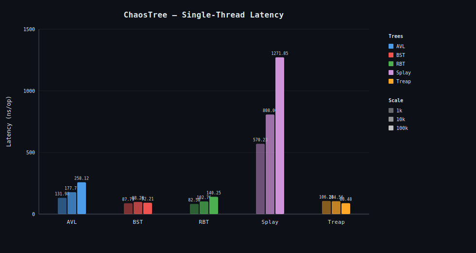
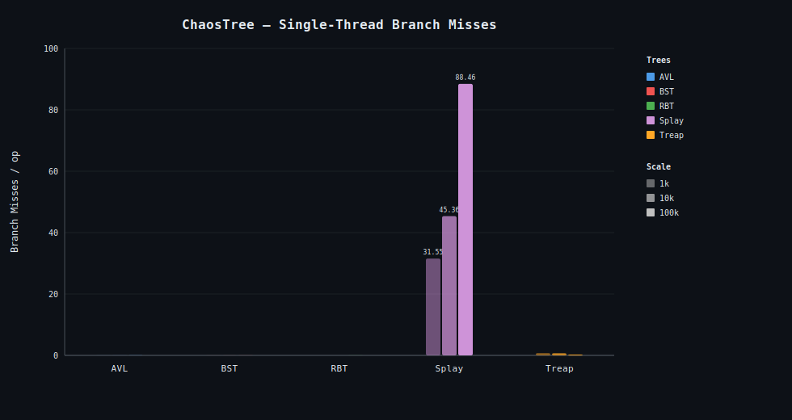
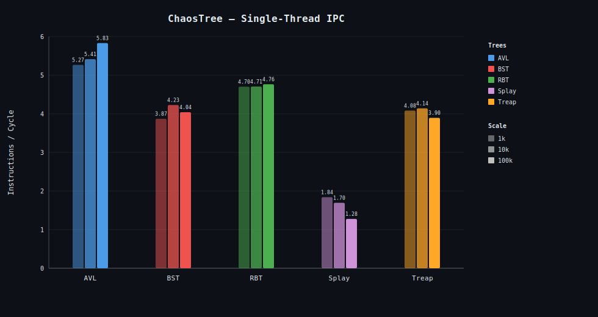
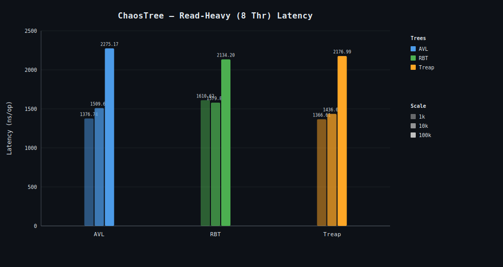
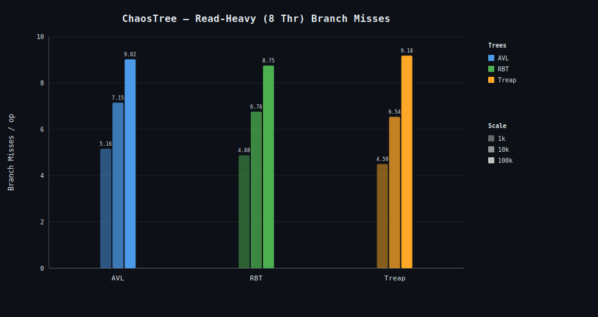
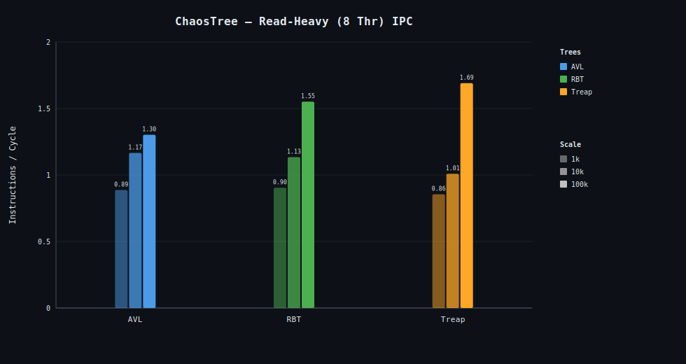
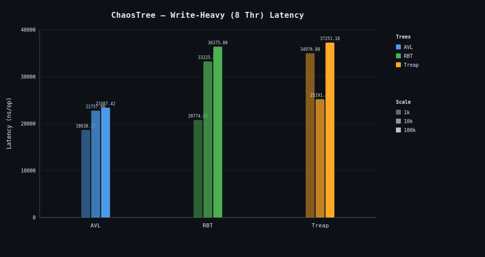
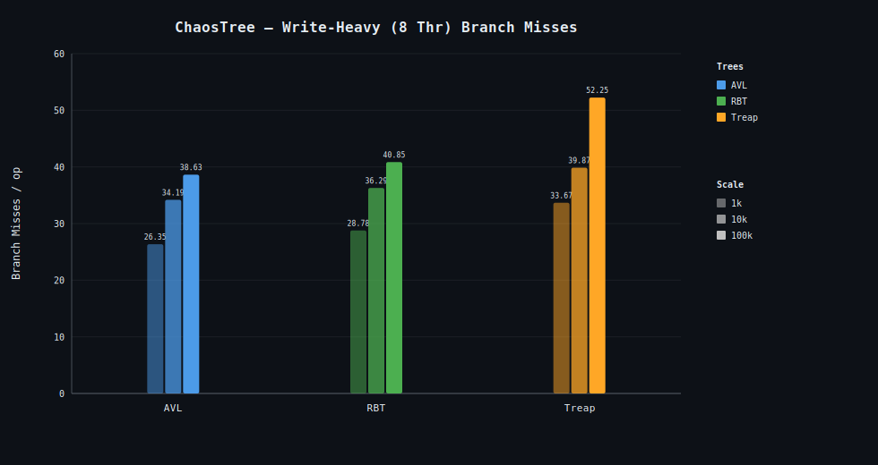
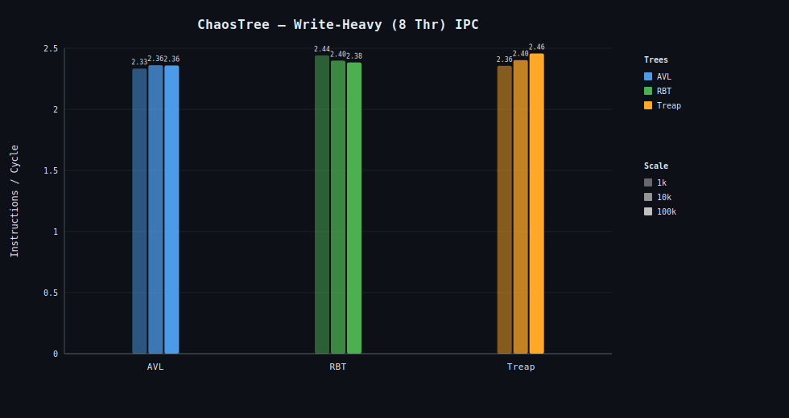

# ChaosTree Binary Family: Benchmark Analysis

This document breaks down the micro-architectural telemetry and JMH benchmark results for the ChaosTree binary collections (`BST`, `AVL`, `RBT`, `Treap`, `Splay`).

← Back to [README](README.md)

---

## 1. Summary & Verdicts

- **Single-Threaded Pure Performance (Read-Heavy):** AVL and RBT lead on search latency. AVL at 95.07 ns/op and RBT at 96.05 ns/op at 100k nodes under Zipfian distribution.
- **Single-Threaded Pure Performance (Write-Heavy):** RBT leads at 140 ns/op at 100k. AVL pays 258 ns/op due to higher rotation frequency. BST is 92 ns/op but provides no balancing guarantee.
- **Concurrent Read-Heavy (8 Threads):** Under external monitor synchronization, RBT delivers the most stable concurrent search latency at scale — 2,134 ns/op at 100k nodes — with the lowest LLC miss rate among the three concurrent-eligible trees.
- **Concurrent Write-Heavy (8 Threads):** Concurrent insert latency is dominated by monitor acquisition cost, not tree structure — AVL (23,387 ns/op), RBT (36,376 ns/op), and Treap (37,251 ns/op) are statistically indistinguishable on insert due to error margins exceeding 50% of the score. The mixed workload is the meaningful signal: RBT stabilizes at 17,960 ns/op at 100k with the lowest variance.
- **Splay Warning:** Splay trees are strictly single-threaded. Because every `contains()` call performs a structural write (splay-to-root), concurrent usage produces data races under any external synchronization model. Splay is excluded from all concurrent benchmarks.

---

## 2. Benchmark Classes

| Class                      | Workload                       | Trees Included                       | Notes                                                       |
|----------------------------|--------------------------------|--------------------------------------|-------------------------------------------------------------|
| ZipfianSearchBenchmark     | Single-thread search           | BST, AVL, RBT, Splay, Treap          | Zipfian access distribution — temporal locality workload    |
| InsertDeleteBenchmark      | Single-thread insert/delete    | BST, AVL, RBT, Treap                 | Shared iteration assumptions                                |
| SplayInsertDeleteBenchmark | Single-thread insert/delete    | Splay only                           | Cold-delete novel-insert protocol — amortized honest cost   |
| ConcurrentBenchmark        | 8-thread search, insert, mixed | AVL, RBT, Treap                      | External monitor synchronization                            |
| ConstructionBenchmark      | Clone and bulk-load            | BST, AVL, RBT, Splay, Treap, TreeSet | GC profiler (`-prof gc`)                                    |

---

## 3. Workload Analysis: Single-Threaded Search (Zipfian Distribution)

All numbers from `ZipfianSearchBenchmark`. Zipfian access distribution simulates temporal locality; results differ significantly from uniform random search.

Baseline topological efficiency with zero thread contention at 100k elements.

| Tree   | Latency (ns/op) | P-Core Branch Misses/op | P-Core Instructions/op |
|--------|-----------------|-------------------------|------------------------|
| BST    | 87.55           | 4.75                    | 362.72                 |
| AVL    | 95.07           | 5.58                    | 350.87                 |
| RBT    | 96.05           | 5.52                    | 357.66                 |
| Treap  | 147.68          | 7.42                    | 688.85                 |
| Splay  | 297.21          | 17.40                   | 2034.78 (mutating)     |

**Architectural insight:** AVL and RBT win on height optimization — branch prediction accuracy stays above 99% on P-cores. BST records 87.55 ns/op at 100k, marginally faster than AVL (95.07) and RBT (96.05), but provides no balance invariant. Splay runs ~3× slower than AVL because every `contains()` splays the accessed node to root via zig/zig-zig/zig-zag rotations — a structural write on every read. Even under Zipfian distribution (which should favor Splay's temporal locality), rotation overhead dominates at 100k nodes.

### Latency at all sizes (ns/op)

| Tree  | 1k     | 10k    | 100k   |
|-------|--------|--------|--------|
| BST   | 42.83  | 63.84  | 87.55  |
| AVL   | 43.41  | 63.06  | 95.07  |
| RBT   | 41.08  | 64.13  | 96.05  |
| Treap | 51.17  | 87.52  | 147.68 |
| Splay | 142.28 | 195.90 | 297.21 |

---

## 4. Workload Analysis: Single-Threaded Insert/Delete

### InsertDeleteBenchmark (BST, AVL, RBT, Treap — ns/op)

| Tree  | 1k     | 10k    | 100k   |
|-------|--------|--------|--------|
| BST   | 87.79  | 98.28  | 92.21  |
| AVL   | 131.98 | 177.71 | 258.12 |
| RBT   | 82.50  | 102.76 | 140.26 |
| Treap | 106.28 | 104.56 | 88.48  |

RBT (140 ns/op) is the fastest balanced tree on write at 100k. AVL (258 ns/op) pays the rotation penalty — roughly 1.8× more expensive than RBT at scale. Treap improves as size grows (106 → 88 ns/op) due to amortized randomized balance behavior.

### SplayInsertDeleteBenchmark (cold-delete, novel-insert protocol — ns/op)

| Size  | Score   | Error   |
|-------|---------|---------|
| 1k    | 570.23  | ±2.16   |
| 10k   | 808.00  | ±15.44  |
| 100k  | 1271.85 | ±25.56  |

Splay is benchmarked separately because the shared `InsertDeleteBenchmark` iteration assumptions violate its amortized cost model. The cold-delete/novel-insert protocol reflects the honest amortized cost: 1,272 ns/op at 100k.

---

## 5. Workload Analysis: Concurrent Tension (8 Threads)

Scaling under a shared external monitor lock. BST excluded (no balance invariant). Splay excluded (`contains()` is a structural write — incompatible with any external sync model).

### Concurrent Search (ns/op)

| Tree  | 1k      | 10k     | 100k    |
|-------|---------|---------|---------|
| AVL   | 1376.74 | 1509.65 | 2275.17 |
| RBT   | 1610.62 | 1579.88 | 2134.20 |
| Treap | 1366.61 | 1436.02 | 2176.99 |

Treap leads at 1k (1,367 ns/op); crossover occurs between 1k and 10k. RBT stabilizes best at scale — 2,134 ns/op at 100k, lowest of the three.

### Concurrent Insert (ns/op) — statistically unreliable

| Tree  | 1k       | 10k      | 100k     |
|-------|----------|----------|----------|
| AVL   | 18,638   | 22,758   | 23,387   |
| RBT   | 20,775   | 33,225   | 36,376   |
| Treap | 34,977   | 25,191   | 37,251   |

Error margins exceed 50% of the score for all three trees. Monitor acquisition dominates; tree structure is irrelevant for insert throughput under coarse locking. Do not draw structural conclusions from this data.

### Concurrent Mixed (insert + delete + search — ns/op)

| Tree  | 1k       | 10k      | 100k     |
|-------|----------|----------|----------|
| AVL   | 9,589    | 16,167   | 19,017   |
| RBT   | 15,050   | 20,558   | 17,960   |
| Treap | 12,631   | 17,340   | 17,271   |

The only statistically reliable write-heavy signal. RBT (17,960 ns/op at 100k) and Treap (17,271 ns/op) are close at scale; both are preferable to AVL (19,017 ns/op), which degrades as rotation overhead lengthens the critical section.

### Summary

| Phase  | Winner             | Latency at 100k (ns/op) | Why                                                                               |
|--------|--------------------|-------------------------|-----------------------------------------------------------------------------------|
| Search | RBT                | 2,134                   | Lowest LLC miss rate at scale; Treap leads at 1k but crossover between 1k and 10k |
| Insert | Statistically tied | ~23,000–37,000          | Monitor acquisition dominates; error margins > 50% for all trees                  |
| Mixed  | RBT ≈ Treap        | 17,960 / 17,271         | RBT: lowest variance. Treap marginally lower score but higher error margin        |

---

## 6. Workload Analysis: Construction & Memory Footprint

All numbers from `ConstructionBenchmark` with `-prof gc`. `gc.alloc.rate.norm` is the canonical bytes-per-operation metric.

### Node size (bytes/node, derived from gc.alloc.rate.norm at 100k)

| Structure | gc.alloc.rate.norm (B/op @ 100k) | Bytes/node |
|-----------|----------------------------------|------------|
| BST       | 2,400,036                        | **24**     |
| AVL       | 3,200,035                        | **32**     |
| RBT       | 3,200,036                        | **32**     |
| Splay     | 3,200,037                        | **32**     |
| Treap     | 3,200,044                        | **32**     |
| TreeSet   | 4,000,101                        | **40**     |

BST node (value + left + right = 3 refs × 8B = 24B) has no parent pointer. AVL/RBT/Splay add a parent pointer (+8B = 32B). Treap adds a priority field (+8B over BST) for 32B total. TreeSet (java.util.TreeMap.Entry) carries key + value + left + right + parent = 5 refs × 8B = 40B.

**Note:** `gc.alloc.rate.norm` measures the structural allocation overhead of the Node wrapper itself during cloning. The Total Footprint at rest—including the 16-byte Integer payload, payload and JVM object alignment—matches the 48-byte vs 72-byte saturation limits detailed in the ADR.

### Clone latency (ms/op)

| Structure | 1k       | 10k      | 100k   |
|-----------|----------|----------|--------|
| BST       | 0.00529  | 0.09204  | 1.0471 |
| AVL       | 0.00544  | 0.05957  | 0.7985 |
| RBT       | 0.00670  | 0.08699  | 1.0685 |
| Splay     | 0.00660  | 0.09454  | 1.3637 |
| Treap     | 0.00513  | 0.07605  | 1.0593 |
| TreeSet   | 0.00724  | 0.10848  | 1.3506 |

### fromIterable (bulk-load) latency (ms/op)

| Structure | 1k       | 10k    | 100k    |
|-----------|----------|--------|---------|
| BST       | 0.07396  | 1.6772 | 30.589  |
| AVL       | 0.09576  | 1.7974 | 34.778  |
| RBT       | 0.12089  | 2.1338 | 36.127  |
| Splay     | 0.17904  | 3.1600 | 52.186  |
| Treap     | 0.14203  | 2.1058 | 43.195  |
| TreeSet   | 0.05425  | 1.1994 | 23.366  |

`TreeSet.fromIterable` is fastest at 100k (23.4 ms/op) because `TreeMap` insertion is a well-JIT-compiled, tight loop with no generics overhead in the hot path. Splay (52.2 ms/op) is worst due to splay-to-root on every insert during construction. AVL (34.8 ms/op) and RBT (36.1 ms/op) are comparable; AVL is marginally faster because its rotation frequency is lower during sequential bulk-load.

---

## 7. Raw Telemetry: Micro-Architectural Profile (Zipfian Search, 100k nodes)

> All telemetry captured via Linux perf counters under Zipfian search distribution at 100,000 nodes running on JDK 21. `cpu_core` = Performance cores. `cpu_atom` = Efficient cores (Intel hybrid architecture).

### Execution Throughput & Clock Cycles

| Algorithm   | Search (ns/op) | P-Core Cycles | E-Core Cycles | P-Core Instructions | E-Core Instructions |
|-------------|----------------|---------------|---------------|---------------------|---------------------|
| bstSearch   | 87.55          | 340.08        | 34.84         | 362.72              | 61.10               |
| avlSearch   | 95.07          | 369.63        | 64.84         | 350.87              | 60.32               |
| rbtSearch   | 96.05          | 373.36        | 106.75        | 357.66              | 66.21               |
| treapSearch | 147.68         | 575.28        | 58.36         | 688.85              | 89.72               |
| splaySearch | 297.21         | 1140.84       | 182.04        | 2034.78             | 114.49              |

### CPU Cache & Memory Controller

| Algorithm   | P-Core L1 Loads | P-Core L1 Stores | P-Core LLC Misses | P-Core dTLB Misses |
|-------------|-----------------|------------------|-------------------|--------------------|
| bstSearch   | 88.77           | 7.65             | 0.018             | 0.006              |
| avlSearch   | 85.61           | 7.49             | 0.027             | 0.010              |
| rbtSearch   | 87.50           | 7.66             | 0.046             | 0.014              |
| treapSearch | 167.23          | 8.70             | 0.031             | 0.015              |
| splaySearch | 477.50          | 146.05           | 0.055             | 0.117              |

Splay incurs ~5.6× more L1 loads and ~19× more L1 stores than AVL at 100k — the direct cost of splay-to-root on every `contains()` call. LLC misses remain near zero for all trees under Zipfian access; the working set fits within L3 at this node count under this distribution.

### Branch Predictor

| Algorithm   | P-Core Branches | P-Core Branch Misses | E-Core Branches | E-Core Branch Misses |
|-------------|-----------------|----------------------|-----------------|----------------------|
| bstSearch   | 64.40           | 4.75                 | 12.87           | 0.23                 |
| avlSearch   | 62.46           | 5.58                 | 19.25           | 0.38                 |
| rbtSearch   | 63.75           | 5.52                 | 21.20           | 0.73                 |
| treapSearch | 119.19          | 7.42                 | 24.69           | 0.51                 |
| splaySearch | 407.50          | 17.40                | 220.43          | 0.28 (E-core)        |

Splay P-core branch misses (17.40/op) are 3.11× higher than AVL (5.58/op), reflecting the non-predictable zig/zig-zig/zig-zag rotation selection on every structural mutation. BST achieves the lowest branch miss rate (4.75/op) as expected — no balance bookkeeping in the search path.

---

## Summary Charts

> Full JMH perflog CSV → [BinaryFamilyGallery/Benchmark.csv](BinaryFamilyGallery/Benchmark.csv)
> GC profiler CSV → [BinaryFamilyGallery/GCprofile.csv](BinaryFamilyGallery/GCprofile.csv)

### Single-Thread Performance

  
  
  

### Concurrent Read-Heavy (8 Threads)

  
  
  

### Concurrent Write-Heavy (8 Threads)

  
  
  

