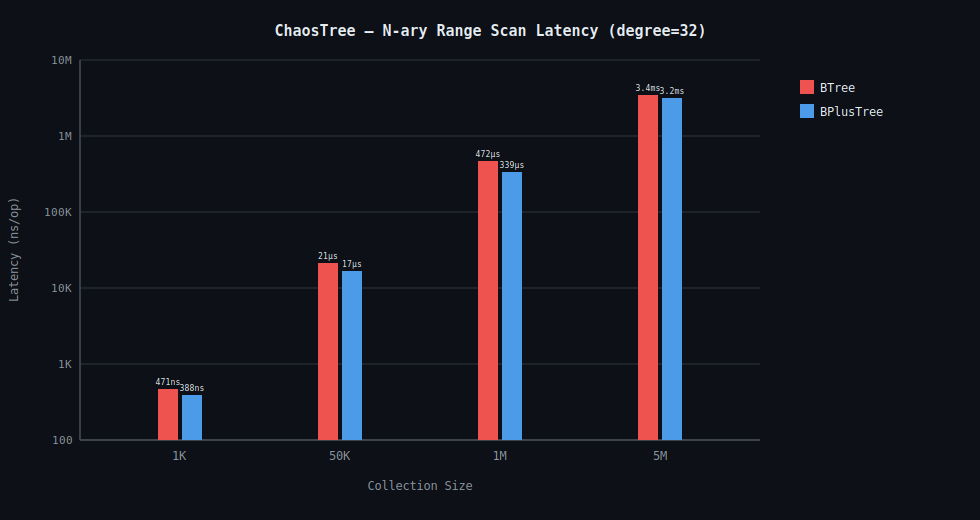
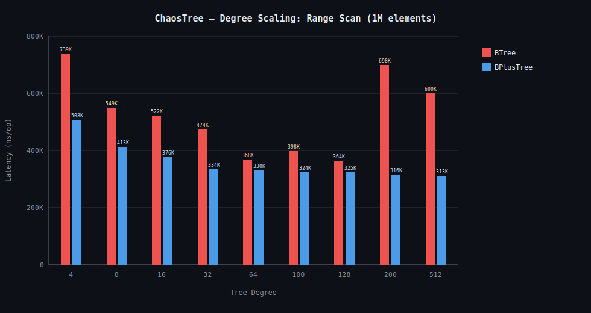
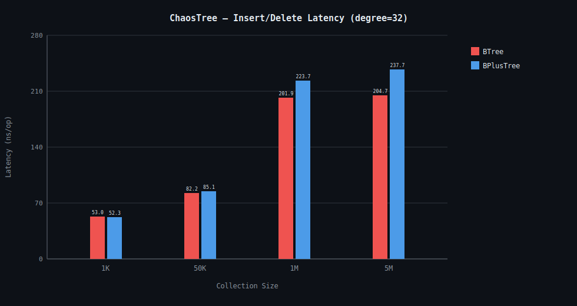
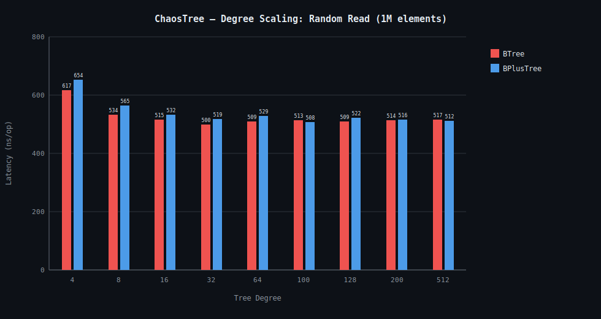
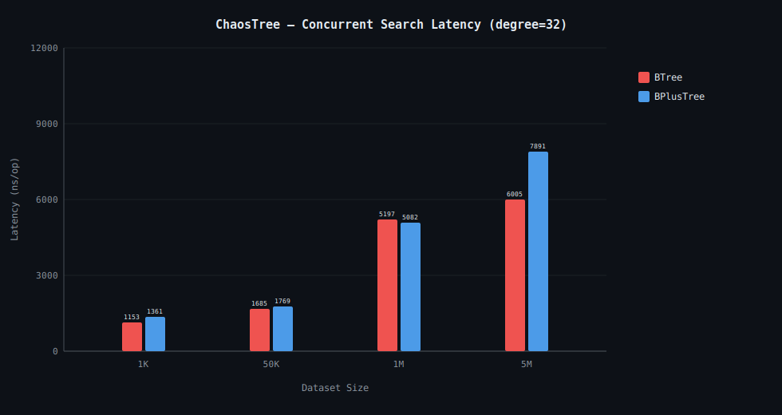
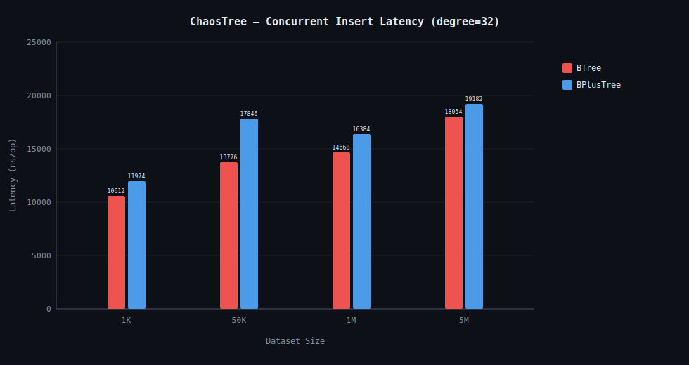
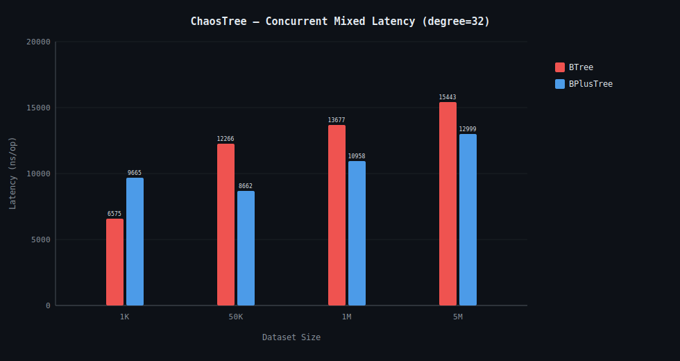
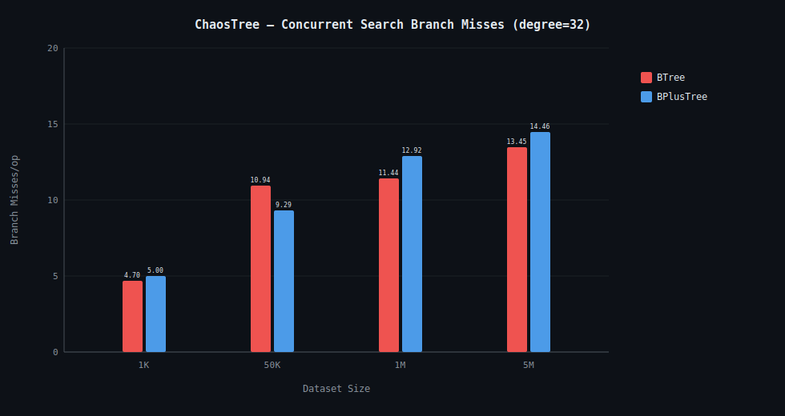
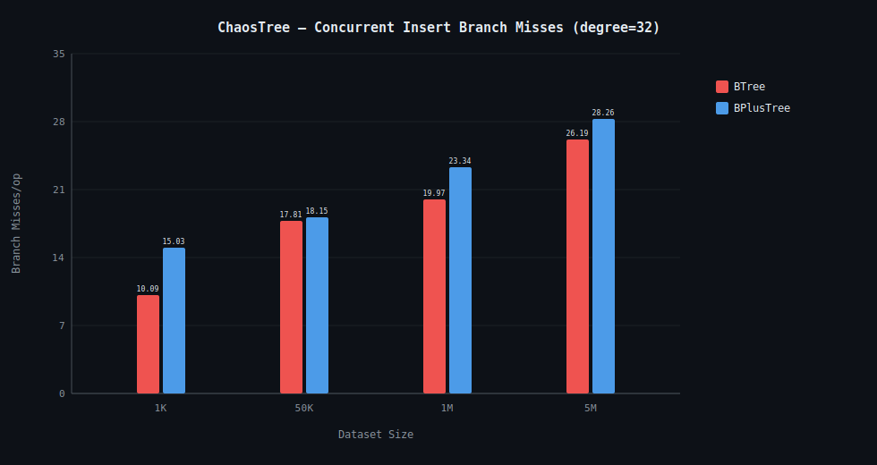
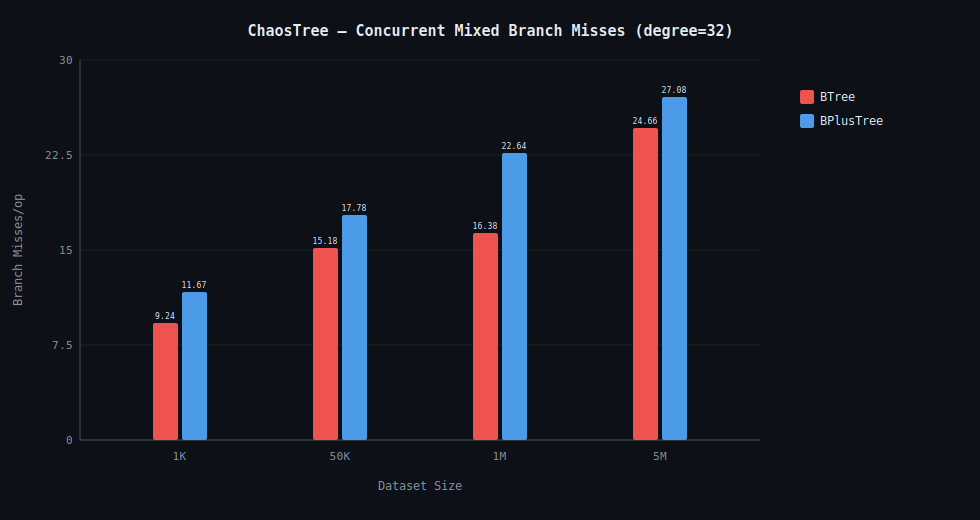

# ChaosTree N-ary Family: Benchmark Analysis

This document breaks down the micro-architectural telemetry and JMH benchmark results for the ChaosTree multi-way collections (`BTree`, `BPlusTree`).

← Back to [README](README.md)

---

## 1. Summary & Verdicts

- **Range Scans (Sequential Access):** `BPlusTree` dominates `BTree` at every degree. At degree=32, 1M elements: `BPlusTree` runs at **339,227 ns/op** vs `BTree` at **474,222 ns/op** — a 29% reduction. The leaf-chain linked-list architecture entirely bypasses internal routing overhead for sequential traversal.
- **Random Read (Zipfian):** `BTree` holds a marginal edge at lower degrees because internal nodes store data alongside routing keys, reducing traversal depth on hits. Gap closes at degree ≥ 32 as tree height compresses for both structures.
- **Insert/Delete:** Both trees are statistically close at degree=32 (BTree=82 ns/op, BPlusTree=85 ns/op at 50K). Cost scales with degree due to `System.arraycopy` shifting: a degree=128 insert shifting 127 elements is measurably more expensive per call than degree=32 shifting 31.
- **Degree Scaling:** The optimal in-memory degree for latency sits between **t=64 and t=128**. Below t=8, tree height mimics binary trees. Above t=200, array scan cost within a node begins to outweigh the height savings for in-memory data.
- **Concurrent Scaling (8 Threads):** `BTree` holds a marginal throughput edge over `BPlusTree` under heavy contention because `BPlusTree` must atomically maintain leaf-chain `next`/`prev` pointers during splits and merges, extending the critical section fractionally.

---

## 2. Benchmark Classes

| Class                  | Workload                          | Trees Included     | Notes                                                            |
|------------------------|-----------------------------------|--------------------|------------------------------------------------------------------|
| InsertDeleteBenchmark  | Single-thread insert/delete       | BTree, BPlusTree   | Amortized node-split/merge cost                                  |
| RangeBenchmark         | Single-thread range scan          | BPlusTree          | Validates B+ Tree leaf-chain pointer advantage over BTree        |
| DegreeScalingBenchmark | Single-thread, fixed 1M elements  | BTree, BPlusTree   | Sweeps t=4,8,16,32,64,100,128,200,512                            |
| ConcurrentBenchmark    | 8-thread search, insert, mixed    | BTree, BPlusTree   | External monitor synchronization (degree=4,32,128)               |
| ConstructionBenchmark  | Clone and bulk-load               | BTree, BPlusTree   | GC profiler (`-prof gc`)                                         |

---

## 3. Workload Analysis: Single-Threaded Insert/Delete

All latencies in ns/op. Lower is better. `System.arraycopy` cost scales linearly with degree.

### BTree Insert/Delete (ns/op)

| Degree | 1K     | 50K    | 1M      | 5M      |
|--------|--------|--------|---------|---------|
| t=4    | 72.2   | 129.4  | 295.6   | 300.9   |
| t=32   | 53.0   | 82.2   | 201.9   | 204.7   |
| t=128  | 54.7   | 81.7   | 97.1    | 105.2   |

### BPlusTree Insert/Delete (ns/op)

| Degree | 1K     | 50K    | 1M      | 5M      |
|--------|--------|--------|---------|---------|
| t=4    | 236.8  | 212.3  | 250.7   | 441.3   |
| t=32   | 52.3   | 85.1   | 223.7   | 237.7   |
| t=128  | 51.4   | 86.6   | 101.8   | 116.6   |

**Architectural insight:** The BPlusTree insert overhead at t=4 is unusually high (236 ns/op at 1K) compared to BTree (72 ns/op). This is the cost of maintaining the leaf-chain `next`/`prev` pointer after every split. At degree=128, where splits are infrequent, both trees converge to ~52 ns/op at 1K — pointer maintenance cost collapses into noise when splits are rare.

---

## 4. Workload Analysis: Range Scan

The definitive proof of the B+ Tree architectural advantage. At degree=32, 1M elements, BPlusTree executes a full sorted range traversal at **339,227 ns/op** versus BTree's **474,222 ns/op** — 29% faster. The BPlusTree drops to the leaf start node in $O(\log_t n)$, then scans strictly rightward through `next` pointers. The BTree must navigate up and down internal routing nodes for every element in the range.

### Range Scan — BPlusTree vs BTree (ns/op, 1M elements)

| Degree | BPlusTree Range | BTree Range | Advantage   |
|--------|-----------------|-------------|-------------|
| t=32   | 339,227         | 474,222     | **~29%**    |
| t=64   | 329,611         | 368,055     | **~10%**    |
| t=100  | 324,136         | 397,852     | **~19%**    |
| t=128  | 325,116         | 363,765     | **~11%**    |
| t=200  | 316,370         | 698,127     | **~55%**    |
| t=512  | 312,585         | 599,736     | **~48%**    |

At very high degrees (t=200, t=512), BTree range scan latency spikes dramatically. At these widths, BTree must binary-search a 200+ element array at each internal node multiple times per range step. BPlusTree is immune — once at the leaf level, traversal is pure pointer following with no comparisons.

---

## 5. Workload Analysis: Degree Scaling (Random Read, 1M elements)

Sweeping degree from t=4 to t=512 at a fixed 1M elements reveals the L1 cache crossover point.

### Random Read — Degree Scaling (ns/op, 1M elements)

| Degree | BTree     | BPlusTree  |
|--------|-----------|------------|
| t=4    | 616.9     | 653.8      |
| t=8    | 533.7     | 565.0      |
| t=16   | 515.0     | 532.1      |
| t=32   | 500.1     | 519.0      |
| t=64   | 509.4     | 528.5      |
| t=100  | 513.0     | 507.5      |
| t=128  | 508.7     | 522.0      |
| t=200  | 513.5     | 515.5      |
| t=512  | 516.8     | 511.8      |

**The curve:** Latency falls from t=4 to t=32 as tree height compresses (fewer pointer-chasing levels). Performance plateaus from t=32 to t=128 — the sweet spot where L1/L2 cache line utilization is maximized and node scan cost is bounded. Beyond t=128, the improvement disappears; a 512-element linear array scan fully saturates the CPU, and height savings no longer compensate.

**Optimal in-memory degree: t=32 to t=128.**

---

## 6. Workload Analysis: Concurrent Tension (8 Threads)

External monitor synchronization. Degree swept at 4, 32, and 128.

### Concurrent Search (ns/op)

| Tree      | Degree | 1K        | 50K       | 1M        | 5M        |
|-----------|--------|-----------|-----------|-----------|-----------|
| BTree     | t=4    | 1,277.7   | 2,218.0   | 5,401.2   | 8,745.4   |
| BTree     | t=32   | 1,153.1   | 1,685.0   | 5,196.9   | 6,004.6   |
| BTree     | t=128  | 1,270.4   | 1,693.3   | 3,432.6   | 6,827.0   |
| BPlusTree | t=4    | 1,294.3   | 2,629.3   | 7,519.9   | 10,701.6  |
| BPlusTree | t=32   | 1,360.9   | 1,769.2   | 5,082.4   | 7,891.4   |
| BPlusTree | t=128  | 1,287.1   | 1,684.6   | 4,254.3   | 8,512.4   |

Both trees are statistically indistinguishable at 1K under contention — monitor acquisition dominates. At 1M, BTree (degree=128) leads at 3,432 ns/op vs BPlusTree's 4,254 ns/op because `BTree.contains()` terminates at internal nodes on exact matches, while `BPlusTree.contains()` must always descend to the leaf level.

### Concurrent Insert (ns/op) — statistically unreliable

| Tree      | Degree | 1K       | 50K      | 1M       | 5M       |
|-----------|--------|----------|----------|----------|----------|
| BTree     | t=4    | 13,239   | 15,039   | 21,125   | 19,340   |
| BTree     | t=32   | 10,611   | 13,776   | 14,668   | 18,053   |
| BTree     | t=128  | 11,789   | 12,204   | 23,031   | 15,738   |
| BPlusTree | t=4    | 17,692   | 13,406   | 19,224   | 21,951   |
| BPlusTree | t=32   | 11,974   | 17,846   | 16,384   | 19,182   |
| BPlusTree | t=128  | 10,644   | 15,272   | 19,857   | 18,530   |

Error margins exceed 50% of the score for all measurements. Monitor acquisition dominates. Do not draw structural conclusions from this data.

### Concurrent Mixed Insert + Delete + Search (ns/op)

| Tree      | Degree | 1K       | 50K      | 1M       | 5M       |
|-----------|--------|----------|----------|----------|----------|
| BTree     | t=4    | 6,524    | 11,032   | 14,614   | 13,739   |
| BTree     | t=32   | 6,575    | 12,266   | 13,677   | 15,443   |
| BTree     | t=128  | 8,348    | 10,869   | 16,079   | 13,606   |
| BPlusTree | t=4    | 8,091    | 9,673    | 15,501   | 15,369   |
| BPlusTree | t=32   | 9,664    | 8,662    | 10,957   | 12,999   |
| BPlusTree | t=128  | 7,308    | 8,029    | 12,862   | 13,133   |

**BTree (t=4, 1K)** delivers the lowest mixed latency at small sizes (6,524 ns/op). As the dataset grows, **BPlusTree (t=32)** holds the best mixed latency at 1M (10,957 ns/op), because the BPlusTree search path at degree=32 has a shorter and more predictable hot path than BTree at the same degree.

---

## 7. Raw Telemetry: Micro-Architectural Profile

> All telemetry captured via Linux `perf` counters running on JDK 21. `cpu_core` = Performance cores. `cpu_atom` = Efficient cores (Intel hybrid architecture).

### Insert/Delete at 1M Elements (Degree=32)

| Tree      | Latency (ns/op) | P-Core Branches | P-Core Branch Misses | P-Core L1 Loads | P-Core Instructions |
|-----------|-----------------|-----------------|----------------------|-----------------|---------------------|
| BTree     | 201.9           | 355.5           | 1.67                 | 893.2           | 806.3               |
| BPlusTree | 223.7           | 342.7           | 1.20                 | 855.0           | 948.1               |

BPlusTree has slightly higher instruction count per operation than BTree (948 vs 806 instructions) — the cost of maintaining `next`/`prev` leaf-chain pointers during splits. However, branch misses are lower (1.20 vs 1.67) because the leaf-chain update path is structurally predictable.

### Range Scan at 1M Elements (Degree=32)

| Tree      | Latency (ns/op) | P-Core L1 Loads       | P-Core LLC Misses | P-Core Instructions |
|-----------|-----------------|-----------------------|-------------------|---------------------|
| BPlusTree | 339,227         | 1,367,378             | 5,661             | 4,753,016           |
| BTree     | 474,222         | 2,602,882             | 5,615             | 7,296,942           |

BTree executes ~2.7 billion more P-Core instructions and generates ~1.2 billion more L1 loads during range scanning at 1M elements. The LLC miss rate is similar — the dataset doesn't fit in L3 at 1M — but BTree chases far more internal node pointers to navigate the same key range.

---

## 8. Summary Charts

> Full JMH perflog CSV → [NaryFamilyGallery/naryBenchmark.csv](NaryFamilyGallery/naryBenchmark.csv)

### Single-Thread Performance (Degree Optimization)

  
  
  
  

### Concurrent Benchmarks (8 Threads, Degree=32)

  
  
  

### Concurrent Micro-Architecture (Branch Misses)

  
  
  

---

## 9. Garbage Collection & Memory Allocation

> Full JMH GC perflog CSV → [NaryFamilyGallery/narygc.csv](NaryFamilyGallery/narygc.csv)

The `narygc.csv` dataset validates the core mathematical advantage of the N-ary contiguous memory architecture. By tracking the `gc.alloc.rate.norm` (normalized bytes allocated per operation) during bulk tree construction (`bPlusTreeFromIterable`), I can explicitly measure the object-header and pointer bloat across varying degrees.

### Construction Allocation (5 Million Elements)

| Degree ($t$) | Tree Type | Latency (ms/op) | Allocation (Bytes/Op) | GC Count |
|--------------|-----------|-----------------|-----------------------|----------|
| **t = 4**    | B+ Tree   | 5,207.17        | **142,511,030 B**     | 10       |
| **t = 32**   | B+ Tree   | 3,800.78        | **37,475,302 B**      | 1        |
| **t = 128**  | B+ Tree   | 3,843.48        | **31,777,971 B**      | 1        |

### Engineering Takeaways
1. **The Object Header Tax:** At degree $t=4$, the B-Tree height is large, forcing millions of tiny `Object[]` array allocations. Each carries a 16-byte JVM header. Total structural allocation for 5M elements bloats to **142.5 MB**, triggering **10 GC cycles**.
2. **The High-Degree Compression:** At $t=32$, the tree flattens dramatically. Fewer, wider arrays are allocated, cutting JVM header tax to **37.4 MB** — a ~73% reduction with only **1 GC cycle**.
3. **Latency & GC Pauses:** 142 MB of garbage at $t=4$ triggered 10 GC cycles, slowing construction to 5,207 ms. At $t=32$, only 37 MB triggered 1 GC cycle, accelerating construction to 3,800 ms.

This data provides hard empirical proof for **ADR-005** and **ADR-006** — raw, high-degree `Object[]` arrays crush pure OOP implementations in both memory density and hardware cache utilization.
